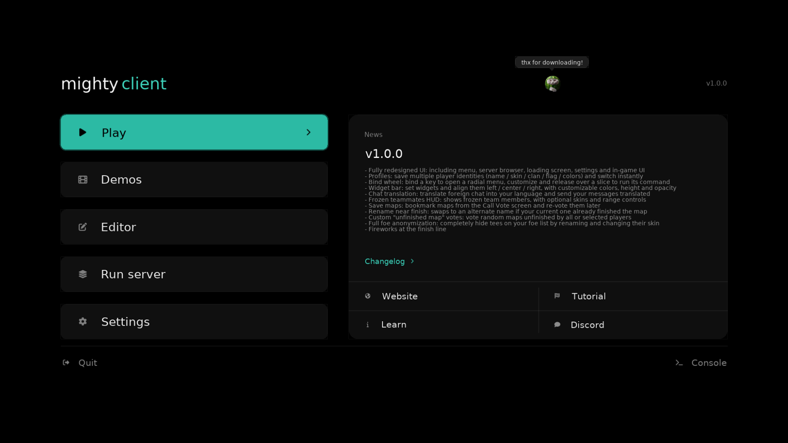
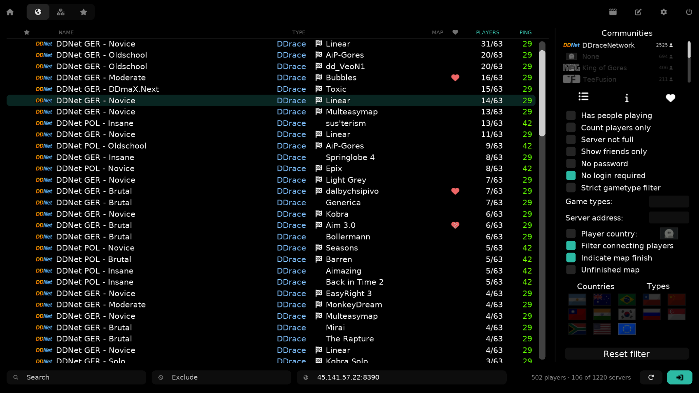
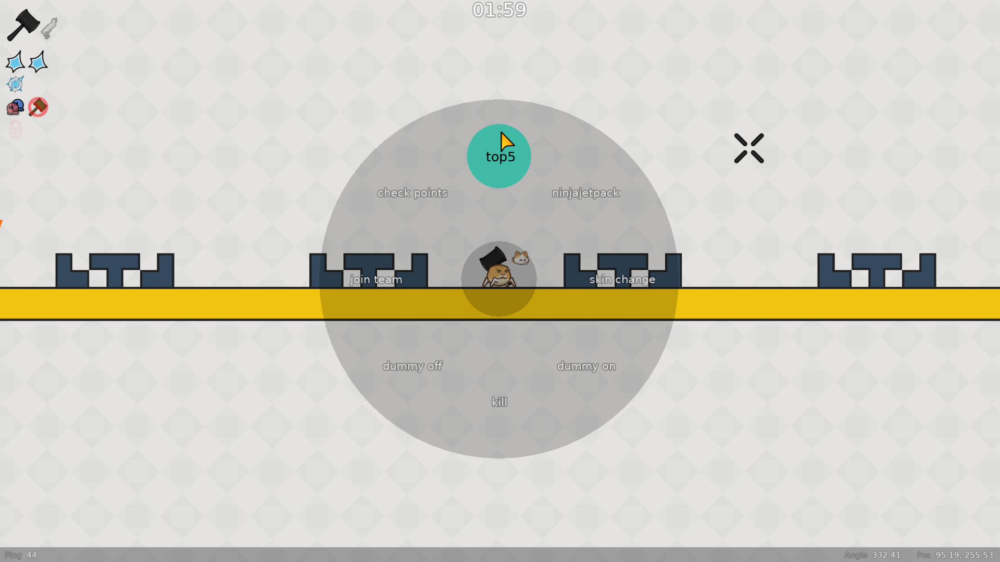
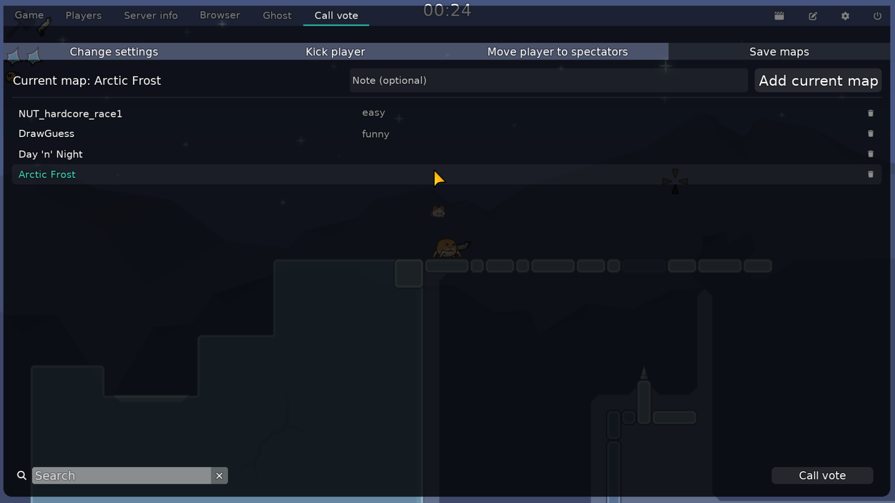
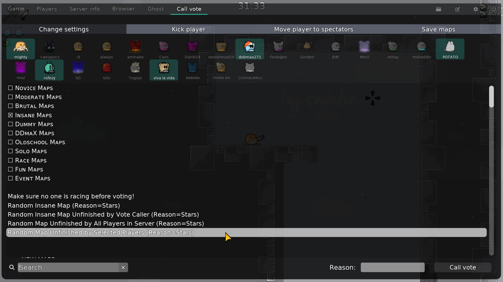
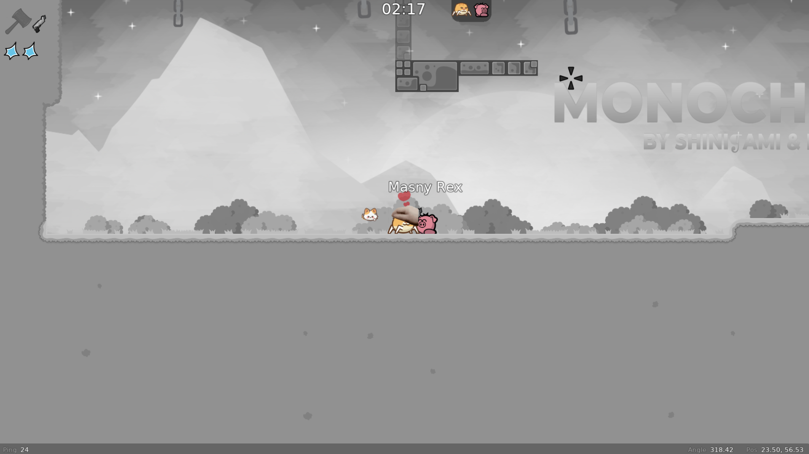

[](https://ddnet.org)

The **mighty client** is a fork of the [DDraceNetwork](https://github.com/ddnet/ddnet) client, which itself is a modification of [Teeworlds](https://github.com/teeworlds/teeworlds). It enhances the gameplay experience a lot by adding important features like incoming and outgoing chat translation, a large binding wheel and some even more essential additions like forcing the maodie skin to all players or showing advertisements or inspiring quotes during the game. On top of that, there are even more original ideas rarely found in other clients, like full anonymization of players on your foe list and custom map votes where you can select players and instantly vote unfinished maps for everyone, instead of the usual vote that only applies to you.

<p align="center">
  
  
</p>

## Full List Of Features
- **Redesigned UI**: menus, browser, settings and loading screen have all been modernized, with the option to adjust the accent color.
- **Chat translation**: incoming foreign chat is auto-translated into your language and you can answer back in any language too.
- **Bind wheel**: a radial quick bind menu with configurable slots up to 16 (reworked from [TClient](https://github.com/TaterClient/TClient)).
- **Fast input**: applies your input for prediction before the next tick, noticeably reducing input delay (copied from [TClient](https://github.com/TaterClient/TClient))
- **Companion pet**: a little tee that floats along next to you in-game (reworked from [TClient](https://github.com/TaterClient/TClient)).
- **Frozen teammates HUD**: see who on your team is frozen, with a compact tee HUD (copied from [TClient](https://github.com/TaterClient/TClient)).
- **Info bar**: a customizable bar with clock, FPS, ping, prediction, position, angle and speed widgets, each positionable left/center/right.
- **Player profiles**: store and switch between multiple identity profiles.
- **Rename before finish**: automatically switch to an alternative name near the finish if your current name already finished the map (not perfect, might have some false alarms).




- **Foe anonymization**: fully hide tees on your foe list by changing their name to "nameless tee" and their skin to default.
- **Custom unfinished map votes**: adds votes where you can select all or specific players on the server and instantly vote unfinished maps for everyone, instead of the usual vote that only applies to you.
- **Saved maps**: get an additional tab in the voting menu to save, note and keep a list of saved maps.

- **Friends across communities**: activated, hides friends who are not playing in the same enabled communities.
- **Finish fireworks**: celebratory fireworks when you finish a map.
- **Optional skin provider**: optionally pull community skins from an extra provider (`skins.ddstats.tw`) on top of the default DDNet one.

<p align="center">
  
  
</p>


If you want to **enhance your gameplay** even more, these are the **most important features** you definitely **have to enable**:

- **Forced maodie skin**: every single tee on the server becomes the best skin ever.
- **In-game advertisements/quotes**: occasionally shows a random advertisement or quote that freezes your inputs and definitely does not annoy.
- **Petting hand**: bob your gun over a nearby tee's head and a little hand appears that pets them.
- **Fat tee**: when someone writes "fat" in chat everyone gets DDFat skins for a few seconds.



## Download
Get the **latest version** of the mighty client from the **[releases page](https://github.com/miightyowl/mighty-client/releases)**.

## Building

The mighty client builds **exactly like DDNet**. First clone this repository:

```sh
git clone https://github.com/miightyowl/mighty-client.git
```

Then follow the official DDNet build instructions for your platform **[here](https://github.com/ddnet/ddnet#dependencies-on-linux--macos)**.

## Credits

- [DDNet](https://github.com/ddnet/ddnet): the base client this fork is built on.
- [TClient](https://github.com/TaterClient/TClient): for several reworked or copied features listed above.
- User 咩咩咩啊 for creating the beautiful maodie skin!!
